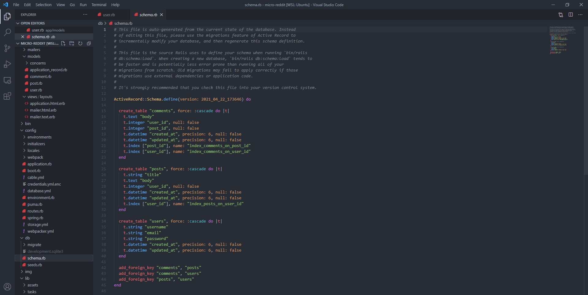

# micro-reddit
A project consists of ActiveRecord to make a micro-reddit with users, posts, and comments.

## Built With

- Ruby on Rails

## Getting Started

- Run this command in your terminal: `git clone https://github.com/sunilkumardevalla/micro-reddit.git` to get a copy of the project.
- From the root folder of the project, run the command bundle install to install any required gems that you might need.

### Prerequisites

* IRB or a Ruby parser installed in your OS terminal.
* A compatible version of Rspec, as of the time of writing, the latest RSpec version is 3.10.0
* A compatible version of Bundler in order to install and check the required gems for this project. As of the time of writing, the latest Bundler version is 2.2.10
* A text editor is not required, but is highly recommended so that you may better preview and edit the code. Popular choices include Atom or VSCode.

### Setup

* Clone the repository in order to get a copy of this project

### Usage
To start testing the models, you can execute the following commands from the Rails console:

*   User.all
*   Post.all
*   Comments.all

🧑‍💻 **Sunil Kumar**

- GitHub: [@DsunilK](https://github.com/sunilkumardevalla)
- Linkedin: [@DsunilK](https://www.linkedin.com/in/sunilkumardevalla/)
- Twiter: [@DsunilK](https://twitter.com/D_sunil_K)

## 🤝 Contributing

Contributions, issues, and feature requests are welcome!

Feel free to check the [issues page](https://github.com/sunilkumardevalla/micro-reddit/issues).

## Show your support

Give a ⭐️ if you like this project!

## 📝 License

This project is [MIT](LICENSE) licensed.